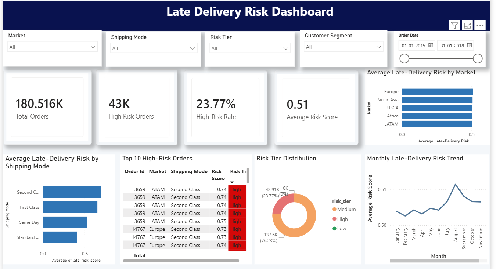
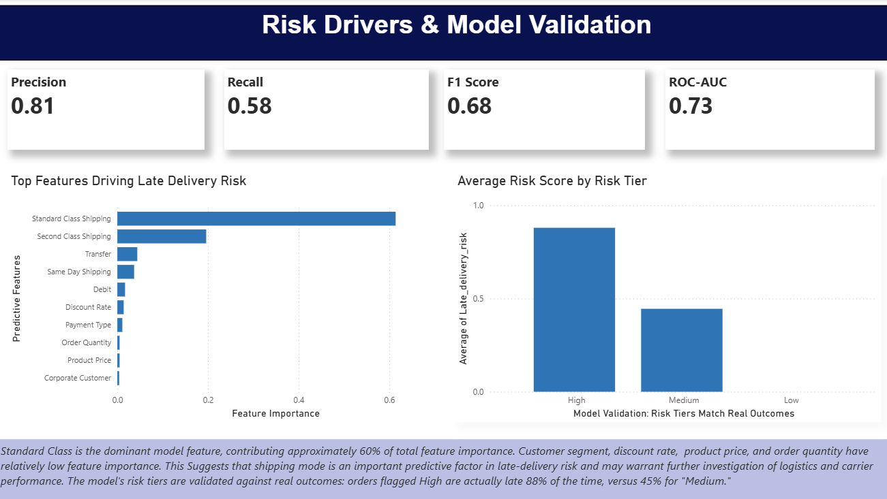

# Late Delivery Risk Dashboard

A Power BI dashboard for analyzing and predicting late-delivery risk using supply-chain and order-level data.

The project combines **data analysis, SQL, machine learning, and Power BI visualization** to identify the factors associated with late deliveries and classify orders into different risk tiers.

---

## 📌 Project Overview

Late deliveries can negatively affect customer satisfaction, operational efficiency, and supply-chain performance.

This project analyzes historical order and supply-chain data to identify patterns associated with delivery delays. A machine learning model is used to estimate late-delivery risk, while Power BI is used to transform the results into an interactive business dashboard.

The dashboard helps users understand:

- Which factors contribute most to late-delivery risk
- How orders are distributed across different risk tiers
- How well the predictive model performs
- Whether predicted risk levels correspond with actual late deliveries
- Which operational areas may require further investigation

---

## 🎯 Objectives

The main objectives of this project are:

- Analyze order and supply-chain data
- Identify major drivers of late delivery
- Build a machine learning model for late-delivery risk prediction
- Classify orders into risk tiers
- Validate model performance using classification metrics
- Create an interactive Power BI dashboard
- Present analytical findings in a business-friendly format

---

## 🔍 Key Insights

The analysis highlights several important patterns related to late-delivery risk.

### Major Risk Driver

**Standard Class Shipping** is the dominant predictive feature, contributing approximately **60% of the total feature importance** in the model.

This indicates that shipping mode plays an important role in predicting late-delivery risk.

### Risk Tier Validation

The model's predicted risk tiers were compared with actual delivery outcomes.

- Orders classified as **High Risk** were actually late approximately **88% of the time**
- Orders classified as **Medium Risk** were actually late approximately **45% of the time**

This provides an indication that the model's risk tiers can help identify orders that require closer attention.

### Other Factors

Other variables considered by the model include:

- Second Class Shipping
- Transfer
- Same Day Shipping
- Debit
- Discount Rate
- Payment Type
- Order Quantity
- Product Price
- Customer Segment

---

## 🤖 Machine Learning Model

A classification model was developed to predict late-delivery risk.

The model was evaluated using standard classification metrics:

| Metric | Score |
|---|---:|
| Precision | 0.81 |
| Recall | 0.58 |
| F1 Score | 0.68 |
| ROC-AUC | 0.73 |

### Model Interpretation

- **Precision (0.81):** A relatively high proportion of orders predicted as risky were actually positive cases.
- **Recall (0.58):** The model identified a moderate proportion of the actual positive cases.
- **F1 Score (0.68):** Provides a balance between precision and recall.
- **ROC-AUC (0.73):** Indicates moderate ability of the model to distinguish between risk classes.

---

## 🛠️ Technologies Used

### Data Analysis
- Python
- Pandas
- NumPy
- Matplotlib
- Scikit-learn

### Database / Querying
- SQL

### Machine Learning
- Scikit-learn
- Classification
- Feature Importance
- Model Evaluation

### Visualization
- Microsoft Power BI

### Development
- Jupyter Notebook
- Visual Studio Code
- Git & GitHub

---

## 📁 Project Structure

```text
late-delivery-risk-dashboard/
│
├── images/
│   ├── risk-overview.png
│   └── risk-drivers-model-validation.png
│
├── models/
│   └── late_delivery_model.pkl
│
├── notebooks/
│   └── 03_model.ipynb
│
├── sql/
│   └── queries.sql
│
├── .gitignore
│
├── README.md
│
└── 01_explore.ipynb

```
---
## 📊 Dashboard Preview

### Risk Overview

The Risk Overview page provides a high-level view of late-delivery risk and key business insights.



---

### Risk Drivers & Model Validation

This page highlights the major factors driving late-delivery risk and evaluates the performance of the predictive model.



---

## 🔄 Project Workflow

The project follows an end-to-end data analytics and machine learning workflow:

```text
Raw Supply-Chain Data
        ↓
Data Exploration & Preparation
        ↓
Feature Selection & Processing
        ↓
Machine Learning Model
        ↓
Late-Delivery Risk Prediction
        ↓
Model Evaluation
        ↓
Power BI Dashboard
        ↓
Business Insights

```

---

## 🛠️ Skills Demonstrated

- **Python** – Data cleaning, preprocessing, exploratory data analysis, and model development
- **Pandas & NumPy** – Data manipulation, transformation, and numerical analysis
- **Data Visualization** – Identifying trends, patterns, and relationships in supply-chain data
- **Machine Learning** – Building and evaluating a predictive model for late-delivery risk
- **Classification Metrics** – Evaluating model performance using classification metrics
- **Feature Importance Analysis** – Identifying the key factors influencing late-delivery risk
- **SQL** – Querying and analyzing supply-chain and order-level data
- **Power BI** – Designing an interactive dashboard with KPIs, charts, filters, and business insights
- **Business Analytics** – Translating analytical findings into actionable supply-chain insights
- **Git & GitHub** – Version control, project organization, and documentation

---

## 📊 Dashboard Outcome

The project transforms raw supply-chain and order-level data into an interactive Power BI dashboard that helps analyze and understand late-delivery risk.

### Key Outcomes

- Provides a **high-level overview of late-delivery risk** and important business indicators.
- Identifies the **major factors influencing delivery delays** using feature importance analysis.
- Presents **model performance and validation results** through an easy-to-understand dashboard.
- Enables users to explore delivery-risk patterns through **interactive visualizations and filters**.
- Converts technical analysis into **business-friendly insights** for supply-chain decision-making.
- Helps highlight areas where organizations can focus on **proactive delivery-risk management**.
- Combines **data analytics, machine learning, SQL, and Power BI** into an end-to-end analytical solution.

---

## 💼 Business Value

The dashboard transforms machine learning results into business-friendly insights that can support supply-chain and logistics analysis.

It can help organizations:

- Identify orders with higher late-delivery risk
- Understand the factors contributing to delivery delays
- Prioritize high-risk orders for further investigation
- Compare risk tiers with actual delivery outcomes
- Identify shipping modes that may require operational attention
- Support data-driven supply-chain decisions

The project demonstrates how predictive analytics can be combined with business intelligence to make complex model outputs easier to understand and act upon.

---

## 🚀 Future Improvements

The project can be further enhanced by:

- Improving model recall to identify more actual late deliveries
- Comparing multiple machine learning algorithms
- Adding an interactive confusion matrix to the model validation page
- Adding order-level drill-through analysis
- Adding customer and product-level risk analysis
- Incorporating regularly refreshed or real-time data
- Adding automated alerts for high-risk orders
- Expanding the dashboard with additional supply-chain KPIs

---

## 👩‍💻 Author

**Mamta Chaudhary**

BSc Data Science & Artificial Intelligence

Interested in **Data Analytics, Business Intelligence, Machine Learning, and Data Science**.

### Connect with me

📧 **Email:** choudharymamta1003@gmail.com

💼 **LinkedIn:** https://www.linkedin.com/in/mamta-chaudhary-964128353/

---

⭐ If you find this project useful, consider giving the repository a star!
